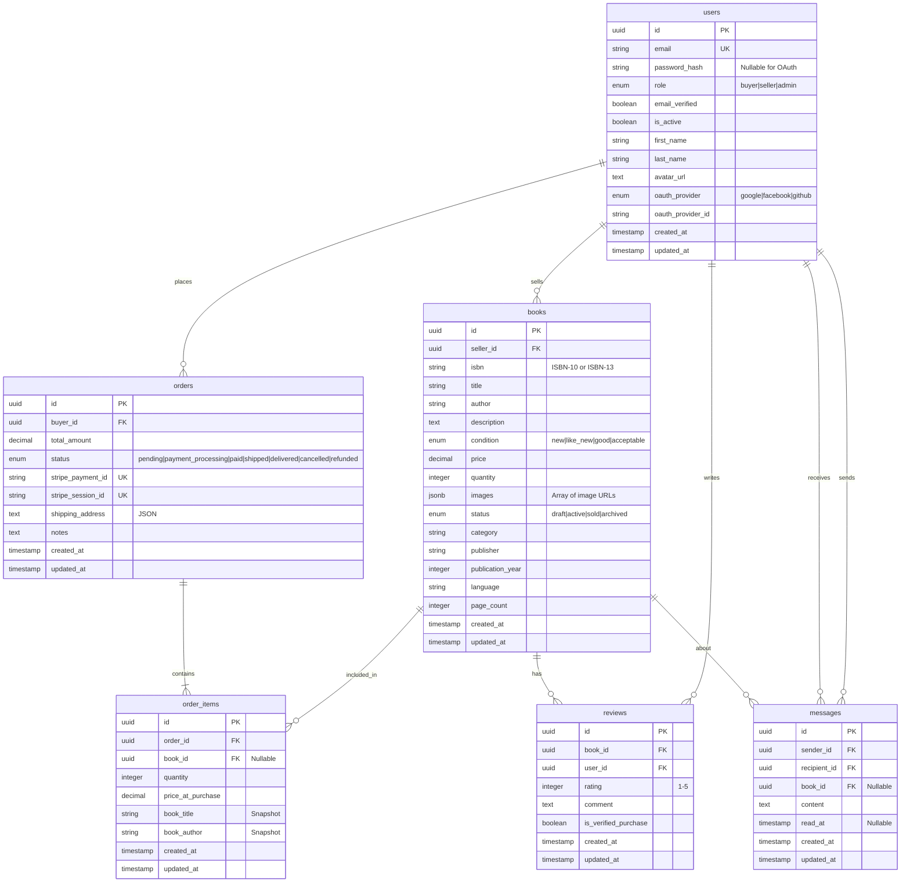
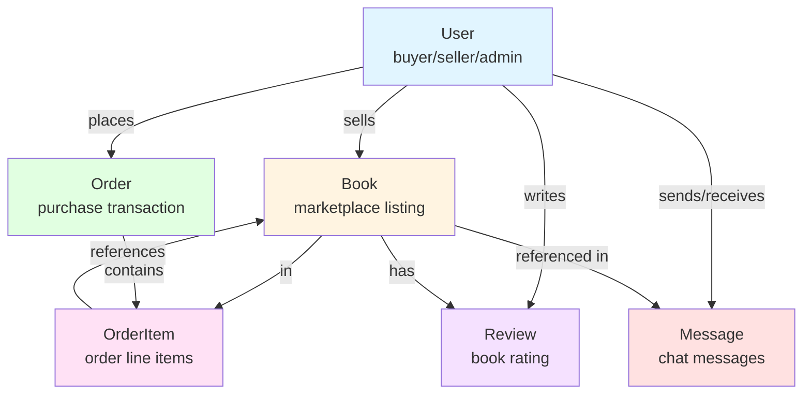

# Entity Relationship Diagram

## Database Schema Overview

This document provides Entity Relationship (ER) diagrams for the Books4All database schema.

## Complete ER Diagram

## Detailed Entity Descriptions

### Users Table
**Purpose**: Stores user accounts for buyers, sellers, and administrators.

**Key Features**:
- Support for both email/password and OAuth authentication
- Role-based user types (buyer, seller, admin)
- Email verification and account activation flags
- Profile information including name and avatar

**Relationships**:
- One user can sell many books (as seller)
- One user can place many orders (as buyer)
- One user can write many reviews
- One user can send/receive many messages

### Books Table
**Purpose**: Stores marketplace book listings created by sellers.

**Key Features**:
- Book identification via ISBN
- Detailed book information (title, author, description, etc.)
- Physical condition and pricing
- Inventory management with quantity tracking
- Multiple status states for listing lifecycle
- JSONB field for multiple product images

**Relationships**:
- Each book belongs to one seller (user)
- One book can appear in many order items
- One book can have many reviews
- One book can be referenced in many messages

### Orders Table
**Purpose**: Represents purchase transactions made by buyers.

**Key Features**:
- Order workflow with status tracking
- Stripe payment integration
- Shipping address storage
- Total amount calculation

**Relationships**:
- Each order belongs to one buyer (user)
- One order contains many order items

### Order Items Table
**Purpose**: Junction table representing individual books within an order.

**Key Features**:
- Captures quantity purchased
- Preserves price at time of purchase
- Stores book snapshot data (title, author) for historical accuracy
- Allows books to be deleted without breaking order history

**Relationships**:
- Each order item belongs to one order
- Each order item references one book (nullable to preserve history)

### Reviews Table
**Purpose**: Stores book reviews and ratings from users.

**Key Features**:
- 1-5 star rating system
- Optional review comment
- Verified purchase flag
- Unique constraint: one review per user per book

**Relationships**:
- Each review belongs to one book
- Each review belongs to one user (reviewer)

### Messages Table
**Purpose**: Enables communication between buyers and sellers.

**Key Features**:
- Direct messaging between users
- Optional book context
- Read status tracking
- Read timestamp for message tracking

**Relationships**:
- Each message has one sender (user)
- Each message has one recipient (user)
- Each message can optionally reference one book

## Key Constraints

### Unique Constraints
- `users.email` - Email addresses must be unique
- `orders.stripe_payment_id` - Stripe payment IDs must be unique
- `orders.stripe_session_id` - Stripe session IDs must be unique
- `reviews(book_id, user_id)` - One review per user per book

### Check Constraints
- `reviews.rating` - Must be between 1 and 5

### Foreign Key Constraints
- Most foreign keys use CASCADE on delete to maintain referential integrity
- `order_items.book_id` uses SET NULL to preserve order history even if book is deleted
- `messages.book_id` uses SET NULL as messages can exist without book context

## Indexes

### Users
- `email` - Unique index for authentication
- `(oauth_provider, oauth_provider_id)` - OAuth lookup
- `(role, is_active)` - User filtering

### Books
- `seller_id` - Seller's listings
- `isbn` - Book lookup
- `category` - Category filtering
- `status` - Status filtering
- `(seller_id, status)` - Seller's active listings
- `(status, created_at)` - Recent listings by status
- `(category, status)` - Category browsing
- `(price, status)` - Price-based sorting

### Orders
- `buyer_id` - User's orders
- `status` - Order status filtering
- `(buyer_id, status)` - User's orders by status
- `(status, created_at)` - Recent orders by status

### Order Items
- `order_id` - Items in an order
- `book_id` - Orders containing a book
- `(order_id, book_id)` - Composite lookup

### Reviews
- `book_id` - Book's reviews
- `user_id` - User's reviews
- `(book_id, rating)` - Rating-based sorting

### Messages
- `sender_id` - Sent messages
- `recipient_id` - Received messages
- `book_id` - Book-related messages
- `(sender_id, recipient_id)` - Conversation lookup
- `(recipient_id, read_at)` - Unread messages
- `(book_id, created_at)` - Book message history

## Enumerations

### UserRole
- `buyer` - Can purchase books
- `seller` - Can sell books (also has buyer privileges)
- `admin` - Platform administrator with full access

### OAuthProvider
- `google` - Google OAuth
- `facebook` - Facebook OAuth
- `github` - GitHub OAuth

### BookCondition
- `new` - Brand new book
- `like_new` - Minimal wear
- `good` - Some wear but fully functional
- `acceptable` - Significant wear but readable

### BookStatus
- `draft` - Not yet published
- `active` - Available for purchase
- `sold` - No longer available (quantity = 0)
- `archived` - Removed from marketplace

### OrderStatus
- `pending` - Order created, awaiting payment
- `payment_processing` - Payment in progress
- `paid` - Payment successful
- `shipped` - Order shipped to customer
- `delivered` - Order delivered
- `cancelled` - Order cancelled
- `refunded` - Order refunded

## Simplified View

For a high-level overview, here's a simplified relationship diagram:

## Database Design Decisions

### 1. UUID Primary Keys
All tables use UUID primary keys for:
- Better security (not predictable)
- Global uniqueness
- Distributed system compatibility

### 2. Soft Deletes via Status
Instead of hard deletes, entities use status fields:
- Books: `status = 'archived'`
- Users: `is_active = false`
- Orders: `status = 'cancelled'`

### 3. Historical Data Preservation
- Order items store book snapshots (title, author, price)
- Allows book details to change without affecting historical orders
- `book_id` is nullable to preserve orders even if book is deleted

### 4. Flexible Relationships
- Messages can exist with or without book context
- OAuth users can exist without password_hash
- Reviews are optional but tracked when purchases are verified

### 5. Performance Optimization
- Strategic indexes on frequently queried fields
- Composite indexes for common query patterns
- JSONB for flexible image storage without additional tables

## Timestamps

All tables include:
- `created_at` - Timestamp of record creation
- `updated_at` - Timestamp of last update

These are managed automatically by the base model.
